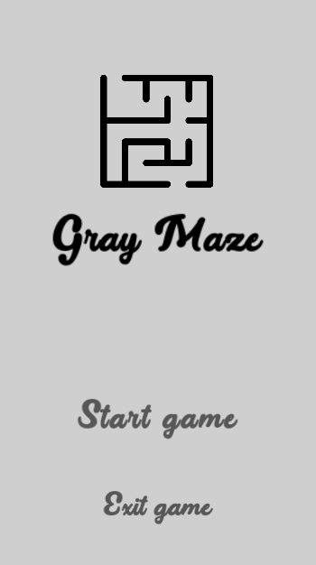
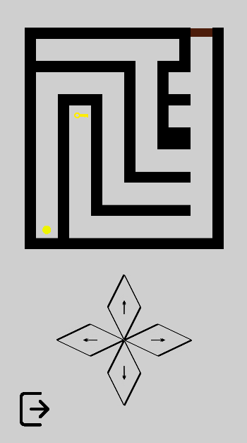
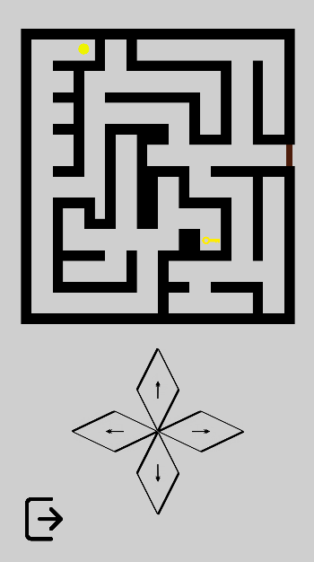

# GrayMaze

## Опис
**GrayMaze** – це 2D-головоломка, у якій гравець керує жовтою кулею, щоб знайти ключ і дістатися до дверей. Гра містить два рівні, після проходження яких з’являється сцена завершення.

## Геймплей
- Гравець керує кулею за допомогою екранних кнопок.
- Потрібно знайти ключ, щоб відкрити двері.
- Вороги та загрози відсутні, головне завдання – навігація лабіринтом.

## Технології
- **Unity** – рушій гри.
- **C#** – основна мова програмування.
- **Tilemap** – використовується для створення лабіринтів.
- **Canvas UI** – для елементів керування (екранні кнопки).

## Платформи
Гра розроблена для мобільних пристроїв (Android).

## Скріншоти
  
  
  

